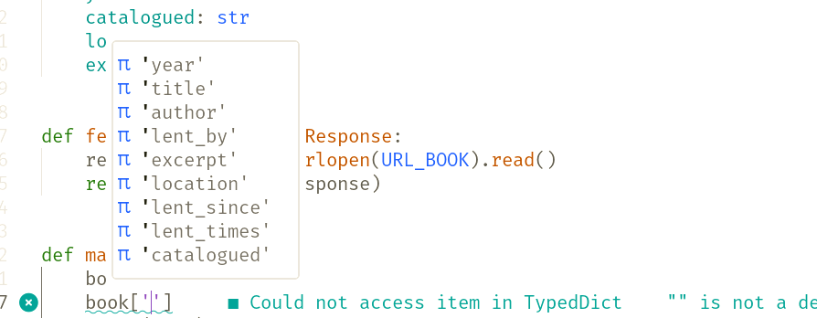

# Chapter 1: Fetching data

<style>
h1 {
    margin-top: 50% !important;
    font-weight: bolder;
    text-shadow: -1px -1px 0 #000, 1px -1px 0 #000, -1px 1px 0 #000, 1px 1px 0 #000;
}
</style>

---

## Fetching data

<br> <hr> <br>

````md magic-move
```python
"""
Typical fetching with the popular requests library
"""
import requests


def fetch_book() -> dict:
    return requests.get(URL_BOOK).json()
```

```python {1-3,5-6|1,2,4,5,10}
"""
Replace
- import with urllib Typical fetching with popular requests library.
- requests.get with urllib.urlopen.
"""
from urllib import request


def fetch_book() -> dict:
    response = request.urlopen(URL_BOOK).read()
```

```python {1-3,5,8,10}
"""
We now have to take care of json ourselves
"""
from urllib import request
import json


def fetch_book() -> dict:
    response = request.urlopen(URL_BOOK).read()
    return json.loads(response)
```

```python {1-5,8-22}
"""
An example response for our project
"""
def fetch_book() -> dict: ...

fetch_book() == dict(
  title="Remarkable Saga of the Clacks",
  author="Alexandra Scott",
  lent_by=null,
  lent_since=null,
  lent_times=8,
  year="The 7th year after Turtle Moves",
  catalogued="year -395 in the 2nd month",
  location="Great Hall: bottom shelve. 5m from the end",
  excerpt=(
      "Near the bubbling cauldron had never seen such a" 
      " sight: some dwarf miner raised the dead. The "
      "annual magical cooking competition begins."
  ),
)
```
````

---
hideInToc: true
---

## Working with data

<hr><br>

````md magic-move
```python
"""Remember this?"""
def fetch_book() -> dict:
    response = request.urlopen(URL_BOOK).read()
    return json.loads(response)


# This is what our data looks like
fetch_book() == dict(
  title="Remarkable Saga of the Clacks",
  author="Alexandra Scott",
  lent_by=null,
  lent_since=null,
  lent_times=8,
  year="The 7th year after Turtle Moves",
  catalogued="year -395 in the 2nd month",
  location="Great Hall: bottom shelve...",
  excerpt="Near the bubbling cauldron...",
)
```

```python
"""We can and should make our lives easier!"""
book_format = dict(
  title="Remarkable Saga of the Clacks",
  author="Alexandra Scott",
  lent_by=null,
  lent_since=null,
  lent_times=8,
  year="The 7th year after Turtle Moves",
  catalogued="year -395 in the 2nd month",
  location="Great Hall: bottom shelve...",
  excerpt="Near the bubbling cauldron...",
)


def fetch_book() -> dict: ...
```

```python
"""We can and should make our lives easier!"""
from typing import TypedDict


book_format = dict(
  title="Remarkable Saga of the Clacks",
  author="Alexandra Scott",
  lent_by=null,
  lent_since=null,
  lent_times=8,
  year="The 7th year after Turtle Moves",
  catalogued="year -395 in the 2nd month",
  location="Great Hall: bottom shelve...",
  excerpt="Near the bubbling cauldron...",
)


def fetch_book() -> dict: ...
```

```python
"""
With TypedDict from typing module we help the IDE
to give us proper type hints!
Positive Sideffect: This helps static code checkers help us
-> e.g. ruff,mypy,pyright,pyre,...
"""
from typing import TypedDict


class BookResponse(TypedDict):
    title: str
    author: str
    lent_by: str | None
    lent_since: str | None
    lent_times: int
    year: str
    catalogued: str
    location: str
    excerpt: str


def fetch_book() -> BookResponse: ...
```
````

---
layout: center
hideInToc: true
---

## This is what it looks like

<hr>



---
layout: image-left
image: images/orang-utan-library.png
hideInToc: true
---

## Let's continue

<br>

<hr> 

<br>

<v-clicks>

- There are a LOT of books. And we only have limited ressources
- This means that we need to work on the books in batches
- Plenty of solutions!
- Let's first look on how it was done before python3.12
- And then how python3.12 makes our live easier :)

</v-clicks>

---

## Batching

<br> <hr> <br>

````md magic-move
```python
"""
Sometimes google/ddg brings one to this or similar stackoverflow
solutions
"""

def batched(some_list: list, size: int = 2) -> list[tuple]:
    """This, I've seen numerous times..."""
    for i in range(0, len(some_list), size):
        batch = some_list[i : i+size]
        if batch:
            yield batch
```

```python
"""
With islice this gets already better ...
... as we can finally even react to generators
"""
from itertools import islice


def batched(some_iterable: Iterable, size: int = 2) -> Iterator[tuple]:
    """Better as we now can even use generators with unknown size!"""
    iterator = iter(iterable)
    
    while batch := tuple(islice(iterator, size)):
        yield batch
```

```python
"""
But why reinvent the wheel?
"""
from itertools import batched
```

```python
from itertools import batched  # we keep this -> we need it later


def only_save_non_duplicates() -> None:
    """
    Imagine we enhanced our fetch_library
    to actually stream the books from library
    """
    lib = fetch_library() # this is a generator
```

```python
from csv import DictWriter
from itertools import batched


LIBRARY_DB = "library_raw.csv"


def only_save_non_duplicates() -> None:
    """
    Using the batched function:
     - iterate through the library
     - and let us work on 10 books at a time!
    """
    lib = fetch_library()

    for batch in batched(lib, 10):
        do_stuff_with_books(batch)
```

```python
from csv import DictWriter
from itertools import batched


LIBRARY_DB = "library_raw.csv"
BOOK_COLS = BookResponse.__annotations.__.keys()


def only_save_non_duplicates() -> None:
    """
    Use a (yet to introduce) filter function to check
    10 books at a time and filter out the non-duplicates
    """
    lib = fetch_library()

    lib_db = Path(LIBRARY_DB)
    with lib_db.open("w") as file:
        writer = DictWriter(file, fieldnames=BOOK_COLS)
        writer.writeheader()
        for batch in batched(lib, 10):
            writer.writerows(batch)
```
````

---
layout: center
hideInToc: true
---

## Great :) - this should work now for future tasks

---
layout: center
hideInToc: true
---

## Summary

### Which modules did we learn about?

<br> <hr> <br>

- csv
- json
- TypedDict

---
layout: center
hideInToc: true
---

## urllib.requests

<br> <hr> <br>

<v-clicks>

- fetch and send data
- restricted to GET/POST
- not as bad to use as one might think

</v-clicks>

---
layout: center
hideInToc: true
---

## itertools.islice

<br> <hr> <br>

<v-clicks depth="2">

- basically works like `mylist[from:to:steps]`
- but also works on Generators with unknown size :)
- cannot go backwards or use negative indizes:
    - works: `mylist[::-1]`
    - doesn't work: `islice(mygenerator, start=-9, step=-3)`

</v-clicks>

---
layout: center
hideInToc: true
---

## itertools.batched

<br> <hr> <br>

<v-clicks>

- Finally arrived in `python3.12`
- Works on all kind of iterable stuff
- delivers `tuple[T]` of size `n`

</v-clicks>

